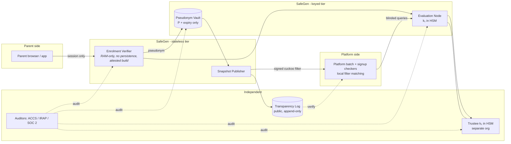

# SafeGen — Engine Design & Architecture

**Parent-consented known-minor attestation infrastructure for Australia's Social Media Minimum Age (SMMA) regime.**
*Tagline: "A signal, not a list."*

> **Design goal in one sentence:** let a platform learn *"this phone number belongs to an enrolled,
> parent-attested under-16"* — and nothing else — without any party retaining a queryable, linkable
> database of children that is worth stealing, subpoenaing, or fearing.

---

## 1. The problem SafeGen solves

The SMMA obligation (Online Safety Act 2021 Part 4A, in force 10 Dec 2025) requires age-restricted
platforms to take reasonable steps to prevent under-16s holding accounts. eSafety's March 2026
compliance update showed the current toolkit leaking on exactly the vectors a *stateless* check
cannot close:

1. **Re-registration.** A child whose account is removed signs up again with a new email and a
   birthdate of 2008. Every platform check is memoryless; the child only has to win once.
2. **Cross-platform migration.** A child removed from Platform A moves to Platform B, which has
   never seen them. No signal travels with them.
3. **Gamed estimation.** The Age Assurance Technology Trial reported facial age estimation error
   bands of up to ~18 months near the 16 threshold, with reduced accuracy reported for some
   demographic groups (Part D) — and platforms allowed repeated attempts until a pass.
4. **Self-declaration.** Still the first (sometimes only) gate on several services.

The one durable, cross-platform identifier that (a) platforms already hold for most accounts,
(b) survives account deletion and re-registration, and (c) a *parent* controls the issuance of, is
the child's **mobile phone number**. SafeGen turns parental knowledge of that number into a
privacy-preserving, revocable, self-expiring **known-minor signal** that any participating platform
can consume as one layer of its age-assurance waterfall.

SafeGen is **not** an age verifier, **not** a decision-maker, and **not** a register. It is a
transient attestation utility: platforms remain the decision-makers and appeal route, exactly as
the regulatory guidance (18 Sep 2025) allocates responsibility.

---

## 2. Actors and trust topology

| Actor | Role | What they can see | What they store |
|---|---|---|---|
| **Parent** | Legal consent authority; enrols child | Everything about own child | A revocation receipt code (offline, theirs) |
| **Enrolment Verifier (EV)** | Ephemeral, ringfenced SafeGen component | Child's raw number + parent identity **for seconds, in memory only** | Nothing (no local persistence; network egress limited to the three allow-listed paths in §6) |
| **Pseudonym Vault (PV)** | SafeGen's only persistent store | Opaque 32-byte pseudonyms + expiry month | `{pseudonym, expiry_month, status, h(receipt)}` |
| **Evaluation Node (EN)** | Holds OPRF key share **k₁** in HSM | Blinded (uniformly random) group elements | k₁ (non-exportable), rate counters |
| **Co-signer / Trustee (CT)** | Independent body holding key share **k₂** | Blinded group elements | k₂ (non-exportable), rate counters |
| **Platform** | Consumes the signal | Yes/no for numbers **it already holds** | Its own compliance decisions + content-free receipts |
| **eSafety / OAIC** | Regulator / privacy enforcement | Transparency reports, audit access, compelled documents | Nothing operational — **no data flows to government** |

Two structural rules do most of the privacy work:

- **Split-key custody.** The OPRF key is `k = k₁·k₂`, multiplicatively shared between the
  Evaluation Node (SafeGen) and an independent Trustee (never eSafety, never a platform; the
  candidate set deliberately includes an **offshore** custodian precisely so that no single legal
  system can quietly compel both legs — see threat model T3 on Australian industry-assistance
  powers). *Every* pseudonym derivation requires both parties, so no single breach, insider, or
  compulsion of one party can turn stored pseudonyms back into phone numbers or run a dictionary
  attack.
- **Blind-before-send.** Raw phone numbers are never transmitted to the key holders. They are
  hashed to a curve point and blinded with a fresh random scalar *before* any OPRF evaluation, so
  EN and CT only ever see uniformly random group elements.

---

## 3. Cryptographic scheme

### 3.1 Primitives

- Group: **ristretto255**; hash-to-group per **RFC 9380**.
- OPRF: **RFC 9497 VOPRF** (verifiable mode), 2-of-2 multiplicative key sharing, with **chained
  per-share proofs** (see §3.2). Verifiability matters: it lets a platform detect a malicious
  service trying to give different platforms *different* PRF outputs (which would otherwise enable
  response-tagging / traffic segmentation).
- Membership structure: signed **cuckoo filter** snapshots. Deliberate sizing choice: FPR 2⁻¹⁰ at
  5M capacity ≈ 8 MB (≈13-bit fingerprints at ~0.95 load; a 20M-account batch screen yields ~20k
  false hits, each costing one ordinary waterfall check — acceptable by design, and false
  positives add plausible deniability to filter contents); a 2⁻²⁰ build (≈15 MB, 23-bit
  fingerprints) is available where platforms prefer fewer false escalations.
  Snapshots are versioned and countersigned into a public **transparency log** (Merkle tree,
  CT-style).
- Signatures: Ed25519. Receipts and snapshots are signed; snapshot signing key is separate from
  OPRF shares.

### 3.2 Pseudonym derivation

For a normalised E.164 number `m` (e.g. `+61412345678`):

```
P  =  H2G(m) ^ (k₁ · k₂)          — the stored/queried pseudonym (32 bytes)
```

Computed obliviously:

```
requester:  x = H2G(m);  pick fresh random r;  send  B = x^r
EN:         B₁ = B^k₁   + DLEQ proof over (G, K₁, B, B₁)      (sees only a random element)
CT:         B₂ = B₁^k₂  + DLEQ proof over (G, K₂, B₁, B₂)     (sees only a random element)
requester:  P = B₂^(1/r)
            verify BOTH proofs against the share public keys K₁ = k₁·G and K₂ = k₂·G,
            and check the published combined key K = k₂·K₁ (fixed at the key ceremony)
```

Each key holder proves its own leg; the chained proofs together bind the output to the single
published combined key. (A single proof over `K = k₁k₂·G` is impossible — no party knows `k₁·k₂` —
and a proof over only one leg would leave the other free to substitute per-platform keys, which is
exactly the tagging attack verifiability exists to prevent.)

**Why this kills the dictionary attack (Threat T1, see threat model):** the Australian mobile
space is `04xx xxx xxx` ≈ 10⁸ candidates — any *unkeyed* hash (SHA-256, scrypt, anything) of a
phone number is reversible in minutes on a laptop. Under the split-key OPRF, an attacker who
steals the **entire Pseudonym Vault** holds 32-byte values indistinguishable from random. To test
even one candidate number they must obtain **both** k₁ (HSM, non-exportable) **and** k₂ (separate
organisation, own HSM) — or drive 10⁸ online evaluations through two independently rate-limited,
volume-published pipelines (burst-capped per day, so a covert sweep takes years and is visible in
the public volume log throughout). The honest residual — a very large platform slowly enumerating
within its legitimate quota — is bounded by **key rotation** (§3.4), which voids any accumulated
number→pseudonym dictionary at each ratchet.

### 3.3 What the Vault stores — the entire long-term record

```
{
  pseudonym:    P               // 32 bytes, meaningless without k₁ AND k₂
  expiry:       2027-09         // month the child turns 16 (derived from parent-attested DOB,
                                // DOB itself is discarded — only the expiry month survives)
  status:       active | revoked
  receipt_hash: h(R)            // hash of the parent's offline revocation code
  epoch:        e               // snapshot epoch of creation (coarse, for rebuild hygiene)
}
```

No name. No date of birth. No parent identity. No address. No linkage between records.
~80 bytes per child. On `expiry`, the record is hard-deleted and drops out of the next filter
snapshot automatically — **the system forgets every child the month they turn 16, by
construction** (including backup media — see §6).

### 3.4 Key rotation — bounding every cached dictionary

`k₁, k₂` are ratcheted on a fixed schedule (annually, and on demand after any suspected
compromise) in a publicly logged EN↔CT ceremony. The Vault is re-derived under the new key via a
blinded batch pass (raw numbers are never needed because `P_new = P_old^(k₁'k₂'/k₁k₂)` is
computable jointly by the two key holders from the stored pseudonyms alone). Consequences:

- Any dictionary of `{number → pseudonym}` accumulated by a platform, a breach, or an insider
  **expires at the next rotation** — cached PRF outputs stop matching all future snapshots.
- Rotation hygiene: the update factor `Δ = k₁'k₂'/(k₁k₂)` is itself key material — computed
  inside the HSMs and destroyed with the old shares — and the Vault re-issues record identifiers
  and storage order at each rotation, so an observer holding before-and-after snapshots cannot
  carry a pre-rotation dictionary across the ratchet via row correspondence.
- Rotation is also the periodic, rehearsed proof that the kill switch works (a rotation where the
  old keys are destroyed and no new ones are created *is* the shutdown procedure).

---

## 4. Enrolment flow (parent-facing, ~2 minutes; ~60 seconds per subsequent child)

```mermaid
sequenceDiagram
    autonumber
    participant Parent
    participant EV as Enrolment Verifier (ephemeral, RAM-only)
    participant EN as Evaluation Node (k₁)
    participant CT as Trustee (k₂)
    participant PV as Pseudonym Vault

    Parent->>EV: 1. Verify self (bank-rail ID attestation, e.g. ConnectID — yes/no assertion, no documents transferred)
    Parent->>EV: 2. Child's mobile number + child's birth month/year + consent declaration
    EV->>EV: 3. Send OTP to child's number; parent enters code (proves control of the number, child present)
    EV->>EN: 4. B = H2G(m)^r   (blinded)
    EN->>CT: 5. B^k₁ + DLEQ proof (EN leg)
    CT->>EV: 6. (B^k₁)^k₂ + DLEQ proof (CT leg) — EV verifies both
    EV->>EV: 7. Unblind → P; compute expiry month; generate receipt R
    EV->>PV: 8. Store {P, expiry, active, h(R)}
    EV->>Parent: 9. Show receipt R once (parent keeps it); session memory zeroed
    Note over EV: Raw number, parent identity result, OTP, DOB: destroyed here.<br/>Lifetime: the enrolment session. No disk write path exists.
```

Design decisions worth noting:

- **Parent identity check is transient.** SafeGen needs to know *a verified adult with a claimed
  parental relationship* enrolled the child — it does not need to remember who. The identity
  assertion (e.g. ConnectID/bank attestation: "verified adult, name matches declaration") is
  consumed and destroyed in-session. What persists is only the fact pattern "an enrolment passed
  policy", not the parties.
- **Control-of-number is the anti-abuse anchor.** The OTP to the child's handset means you cannot
  enrol a number you don't control — a bully cannot flag a classmate, an ex-partner cannot flag an
  adult (Threat T2/T6).
- **The receipt is the revocation credential.** Parent keeps code `R`; presenting `R` (or
  re-proving control of the number) revokes. No account, no login, no stored parent contact.
- **Consent is express and unambiguous**, captured as a signed consent artefact hash in the
  transparency log (content-free), and designed to engage the s63F consent-based retention
  pathway for the derived pseudonym — with the whose-consent question (parent on behalf of a
  13–15-year-old vs the child's own capacity) treated as an open legal issue, not a solved one
  (see §7 and §9 (limitation 5)).
- **The OTP delivery path is itself ringfenced.** A naive implementation would leak every enrolled
  child's number into a commercial SMS provider's delivery logs — quietly rebuilding the exact
  list this design exists to avoid. SafeGen therefore sends OTPs via direct carrier submission
  under contractual no-log/short-purge terms, mixed with decoy traffic, with an app/passkey-based
  possession proof as the roadmap alternative. Modelled explicitly as threat **T10**.
- **The EV is the honest single-party exposure.** For the seconds of a session, the EV alone
  sees both the raw number and (after unblinding) its final pseudonym. A compromised or compelled
  EV logging those pairs over time would slowly rebuild the very dictionary the split keys make
  uncomputable at rest — so it is modelled head-on (threat model **T5a**) rather than assumed
  away: the controls are no persistence, egress allow-listing, reproducible attested builds and
  confidential-compute quotes, and the roadmap moves blinding/unblinding into the parent’s
  browser so no SafeGen component ever holds a number and its pseudonym together.

## 5. Query flows (platform-facing)

Two modes, both double-blind. In both, **matching happens inside the platform's infrastructure**
— SafeGen never learns which numbers matched, or even which numbers were asked about.

### 5.1 Mode A — batch screen (stock: find existing known-minor accounts)

```
┌──────────────┐   1. blinded batch  {H2G(mᵢ)^rᵢ}   ┌──────────────┐        ┌─────────┐
│   PLATFORM   │ ───────────────────────────────────▶│  EVAL NODE   │───────▶│ TRUSTEE │
│              │                                     │   (k₁, HSM)  │  ^k₂   │  (k₂)   │
│  holds its   │ ◀─────────────────────────────────  └──────────────┘◀───────└─────────┘
│  own users'  │   2. evaluated batch + DLEQ proofs         rate-limited, volume-logged
│  numbers     │
│              │   3. unblind locally → {Pᵢ}
│              │   4. test each Pᵢ against SIGNED CUCKOO-FILTER SNAPSHOT (fetched, verified
│              │      against transparency log) → local yes/no per account
└──────────────┘   5. hits → route those accounts into the platform's OWN age-assurance
                      waterfall (this signal is one layer, not a verdict)
```

- SafeGen components see only random group elements and a count.
- The platform learns membership **only for numbers it already lawfully holds** — the filter is
  useless for discovery because filter entries are OPRF outputs the platform cannot compute
  without going through the rate-limited pipeline.
- Quota: per-platform evaluation budget scaled to declared AU monthly active accounts (e.g.
  1.3× MAU per quarter, with independent per-day burst caps), enforced at **both** EN and CT and
  published per-platform in the transparency log. Stated honestly: quotas make enumeration of the
  10⁸ AU number space *slow and public*, not impossible — a 20M-MAU platform could sweep the space
  in roughly a year of maximal, visibly anomalous usage. The structural bound is key rotation
  (§3.4): any dictionary so accumulated stops matching all snapshots at the next annual ratchet,
  so the payoff never exceeds one rotation period of stale membership data — and the spend to get
  it is permanently on the public record.

### 5.2 Mode B — point check (flow: new signups & re-registrations)

At signup, the platform runs a single-number version of the same round (one blinded element,
~2 sequential exponentiations, <150 ms budget) and tests the local snapshot. A **hit at signup is
exactly the re-registration and cross-platform-migration catch**: the child who was removed from
Platform A and walks into Platform B with the same phone number matches on day zero, before
self-declared age or a coached selfie ever comes into play.

### 5.3 What the platform gets back, concretely

1. **Locally:** a boolean per checked number (filter hit / no hit), plus the DLEQ proof transcript
   showing the evaluation was performed against the published key.
2. **From SafeGen:** a signed, content-free **compliance receipt** per batch/query session:
   `{platform_id, batch_commitment_hash, count, snapshot_version, timestamp, sig}`.
   This is the platform's evidence for eSafety that the layer was actually run — including, if
   the June 2026 amendment bill is enacted as introduced, under the proposed compelled-documents
   powers reaching third-party age-assurance providers. It contains **zero personal
   information**, so both the platform and SafeGen can retain it without engaging s63F.
3. **Never:** an identity, a DOB, a confidence score, or a writeable API to add/label users.

**Semantics of a hit (important for both fairness and law):** a hit means *"a verified adult,
controlling this number, attested a minor uses it — attestation not expired, not revoked."* The
platform's required response is to **escalate that account into its normal waterfall** (document-
based verification, estimation with liveness, etc.), not to hard-block. An adult falsely enrolled
(prank, stale SIM) passes the waterfall and the platform records a local override. SafeGen makes
no decision about any individual, which keeps it a signal utility rather than an automated-
decision system.

---

## 6. Component architecture



Operational properties:

- **EV is destroy-by-design:** stateless container, no database driver, no volume mounts; egress
  allow-listed to EN, the Vault’s fixed-schema insert endpoint, and the direct carrier submission
  interface (T10) only. The Vault insert is the one write path that exists — schema-validated and
  count-reconciled, though EV *integrity* ultimately rests on reproducible, attested builds
  (measured boot / confidential-compute attestation quoted in the transparency log; threat model
  T5a). "We delete it" is backed by "there is nowhere to keep it."
- **PV is the only persistent store** and it is deliberately boring: no personal information
  columns exist in the schema. Its entire contents could be published tomorrow and remain
  unlinkable without both HSM keys.
- **Backups obey the same clock.** PV backups are envelope-encrypted under a rotating backup key
  and retained for at most one snapshot epoch, so 16th-birthday expiries and revocations propagate
  to *all recoverable media* within ~24h; the kill switch destroys the backup key alongside k₁,k₂.
  Without this, "forgets by construction" would be marketing — with it, it's an operational
  invariant auditors can test.
- **Snapshots are epochs.** The filter is rebuilt each epoch (daily) from live records only —
  revocations and 16th-birthday expiries propagate within 24h, and there is no delta trail that
  would let observers diff snapshots to track individuals (epoch re-salting: each snapshot keyed
  by `P' = H(P ‖ epoch_salt)` with the salt distributed with the snapshot, so cross-epoch
  correlation of filter *contents* is broken while platform-side matching still works).

---

## 7. The s63F ringfence-and-destroy compliance story

Section 63F requires that personal information collected for age-assurance purposes be
**destroyed once used** (de-identification is insufficient), with a narrow pathway where the
individual's **unambiguous consent** covers a further specified use, and OAIC enforces breaches as
interferences with privacy. SafeGen is architected so the answer to "what do you retain?" is
almost nothing, and the answer to "under what authority?" is layered:

| Information | Collected by | Used for | Fate | s63F posture |
|---|---|---|---|---|
| Child's raw mobile number | EV only | OTP dispatch + pseudonym derivation | Zeroed at session end; never written to disk | Destroyed after use — structurally enforced (no local persistence; the only path to the persistent store is the fixed-schema, count-reconciled Vault insert) and independently attested; see caveat below |
| Parent identity assertion | EV only | Enrolment policy gate | Consumed in-session; only "policy passed" survives | Destroyed after use |
| Child's birth month/year | EV only | Compute expiry month | Discarded; only expiry month survives | Destroyed after use |
| OTP / device metadata | EV only | Control-of-number proof | Session only | Destroyed after use |
| **Pseudonym P + expiry month** | Derived at EV | The attestation itself | Retained until the month the child turns 16, then hard-deleted (including backups, §6) | Primary basis: express, unambiguous, informed consent to this exact purpose, captured at enrolment — the consent pathway contemplated by s63F. **Open question, stated plainly:** s63F's exception turns on the consent of *the individual the information is about*; OAIC guidance presumes capacity from around age 15, so whether a parent's consent suffices for the 13–15 cohort (or whether the child must co-consent, which the OTP-on-the-child's-phone ceremony naturally supports) needs formal advice — see §9 (limitation 5). Fallback argument only: P is not reasonably identifiable without both split HSM keys; this must be distinguished carefully from mere de-identification, which s63F expressly rejects as a substitute for destruction. |
| Blinded query elements | EN / CT | OPRF evaluation | Never stored; counters only | Uniformly random values — no personal information received at all |
| Platform receipts / transparency log | SafeGen + platform | Compliance evidence | Retained | Content-free; contains no personal information by construction |

Honest framing, stated in the doc because regulators will ask: deletion at EV is **attested and
auditable, not cryptographically self-proving** — no system can mathematically prove a negative
about copies. SafeGen's claim structure is: (1) minimise what is ever received in clear to one
ephemeral component; (2) make non-retention structurally enforced (no persistence layer) and
attestable (reproducible builds, confidential compute quotes); (3) submit to continuous
third-party audit (ACCS certification against ISO/IEC 27566, IRAP, SOC 2 Type II) and OAIC/eSafety
scrutiny — including, if enacted, the compelled-documents powers proposed in the June 2026
amendment bill. This is the same assurance grammar the
Age Assurance Technology Trial credited as achievable ("private, robust and effective" without
retention).

**The centrepiece:** most age-assurance s63F anxiety is about biometric images and ID documents.
SafeGen collects neither, from either parent or child, ever. The riskiest datum it touches is a
phone number the platform already holds — for seconds.

---

## 8. Governance, accreditation and regulator relationship

- **SafeGen is adopted by platforms, supervised by regulators.** Platforms contract with SafeGen
  as a third-party age-assurance provider forming one layer of their "reasonable steps" under the
  18 Sep 2025 regulatory guidance (which is technology-neutral and explicitly contemplates
  layered/waterfall assurance and parental involvement). eSafety approves nothing operationally
  and receives no data; it audits outcomes and — if the June 2026 amendment bill passes as
  introduced — could compel documents from third-party providers directly, which SafeGen's
  transparency log and content-free receipts are pre-built to answer.
- **Trustee independence is constitutional.** The k₂ Trustee is contractually and technically
  unable to be merged, acquired, or directed by SafeGen, a platform, or government without key
  destruction (key ceremony re-run required, publicly logged). Candidate trustees: an accredited
  conformity-assessment body or a university security lab — with a deliberate preference for an
  **offshore** custodian in a strong-rule-of-law jurisdiction, so Australian industry-assistance
  powers (TOLA) cannot quietly compel both key legs at once (threat model T3 analyses this in
  full; an all-Australian custody arrangement would be the design's single largest concession).
- **Standards surface:** ISO/IEC 27566 (age assurance), IEEE 2089.1, ACCS certification, IRAP for
  hosting, annual public cryptographic review.
- **Kill switch:** governance allows orderly shutdown = delete PV and its backup key + destroy
  k₁,k₂ → every artefact in the world (snapshots, receipts, logs, old backups) becomes permanently
  meaningless random data. A system that can be *verifiably shut down* — and that rehearses the
  procedure at every key rotation (§3.4) — is the opposite of a honeypot.

---

## 9. Known limitations (stated, not hidden)

1. **Coverage is opt-in.** SafeGen raises the floor for enrolled children; it is a layer, not the
   ban's enforcement mechanism. Its value scales with parent adoption (school/community campaigns,
   platform prompts at teen-signal detection, telco family-plan integration are the growth rails).
2. **Number churn.** A child with a new SIM disappears until re-enrolled; parent nudges at
   snapshot anniversaries and telco partnerships (family plans know the mapping) mitigate.
3. **SIM recycling / stale attestations.** Expiry-by-construction caps staleness at the time to
   16; recycled numbers hitting a filter cause at most one extra waterfall check for the new
   holder, with platform-side override.
4. **Determined circumvention** (overseas eSIM, no-phone signup paths) is out of scope for this
   layer and remains with the platform waterfall — consistent with eSafety's position that no
   single measure is expected to be perfect, only "reasonable".
5. **Two open legal questions need formal advice before pilot:** (a) whether s63F's consent
   exception is satisfied by *parental* consent for a 13–15-year-old, given OAIC's presumption of
   capacity from around 15 — the enrolment ceremony already involves the child (OTP on their
   phone) and can be extended to capture the child's own assent; (b) the characterisation of the
   retained pseudonym, noting the "not personal information" argument must be clearly
   distinguished from de-identification, which s63F rejects as a substitute for destruction.
   The design treats both as risks to manage, not assumptions to build on.
6. **The OTP delivery path is the residual cleartext exposure.** Possession proof requires
   reaching the child's handset; without the T10 mitigations (direct carrier no-log submission,
   decoy traffic, app-based proof) an SMS provider's logs would slowly accumulate enrolled
   numbers. This is engineered around, but it is the honest weak point of the enrolment ceremony
   and is stated as such.

---

*Companion documents: [02-threat-model.md](02-threat-model.md) — adversarial analysis;
[03-positioning.md](03-positioning.md) — regulatory mapping. Parent-facing mockup:
[../site/index.html](../site/index.html).*
